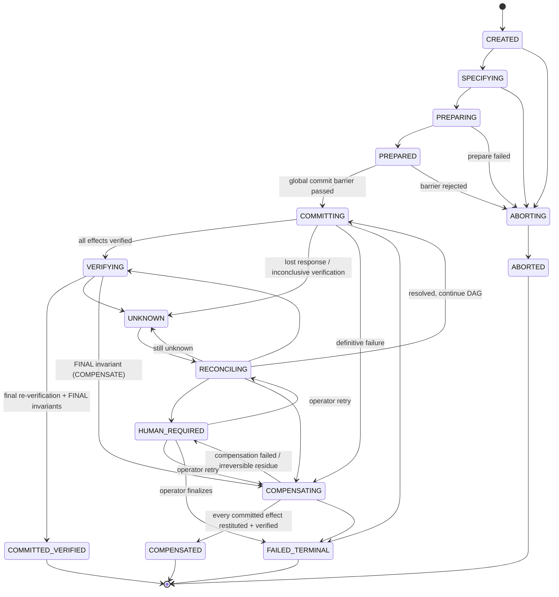

# PACT state machines

Both machines are defined in one place — `backend/app/core/state_machine.py` — and every state change goes through `TransactionManager.transition_tx` / `transition_effect`, which validate the transition and append a `TRANSACTION_STATE_CHANGED` / effect event **in the same database transaction**. PostgreSQL CHECK constraints additionally restrict the `state` columns to these enums. Invalid transitions raise `INVALID_STATE_TRANSITION` (HTTP 409).

## Transaction

Rules:

- Terminal: `COMMITTED_VERIFIED`, `ABORTED`, `COMPENSATED`, `FAILED_TERMINAL`. A receipt is issued for every terminal transaction (root and children).
- `UNKNOWN` is **not** terminal and cannot move directly to success or failure — only through `RECONCILING`.
- `HUMAN_REQUIRED` suspends automatic progression; only recorded operator actions move it on.
- `COMPENSATED` is reached only when nothing committed remains un-restituted. Irreversible residue or failed compensation → `HUMAN_REQUIRED`. PACT never reports "rolled back".
- After the barrier, child transactions mirror the root's phase (children cannot commit independently). Their individual detail lives on their effects and on the events showing each child reached `PREPARED` locally.

## Effect

```mermaid
stateDiagram-v2
    [*] --> PROPOSED
    PROPOSED --> VALIDATED: schema + registered contract
    VALIDATED --> PREPARED: local authority + read-only preconditions
    PREPARED --> DISPATCHING: intent persisted (attempt row) BEFORE the call
    DISPATCHING --> DISPATCHED: provider said success (not verified!)
    DISPATCHED --> VERIFYING
    VERIFYING --> VERIFIED: external state independently confirmed

    DISPATCHING --> UNKNOWN: response lost / 5xx
    DISPATCHED --> UNKNOWN
    VERIFYING --> UNKNOWN: still pending after poll budget
    UNKNOWN --> RECONCILING: query by operation identity (no re-execution)
    RECONCILING --> VERIFIED: found applied + verified
    RECONCILING --> RETRYABLE: provider authoritatively says not applied
    RECONCILING --> UNKNOWN
    RECONCILING --> HUMAN_REQUIRED: conflicting evidence

    DISPATCHING --> RETRYABLE: 503/429 before applying
    RETRYABLE --> DISPATCHING: new attempt, SAME idempotency key
    DISPATCHING --> FAILED: definitive rejection
    VERIFYING --> FAILED: provider said success, reality disagrees
    RETRYABLE --> FAILED: attempt budget exhausted

    VERIFIED --> COMPENSATING
    COMPENSATING --> COMPENSATED: inverse applied + verified
    COMPENSATING --> HUMAN_REQUIRED
    HUMAN_REQUIRED --> COMPENSATING
    HUMAN_REQUIRED --> COMPENSATED: operator attests manual restitution

    PROPOSED --> ABORTED
    VALIDATED --> ABORTED
    PREPARED --> ABORTED: never dispatched; released
    RETRYABLE --> ABORTED
```

There is deliberately no `success: bool` anywhere. The distinction between `DISPATCHED` (`TOOL_CALL_SUCCEEDED`) and `VERIFIED` (`BUSINESS_EFFECT_VERIFIED`) is the point.

## Logical operation (idempotency identity)

`AVAILABLE → RESERVED (barrier, owned by one root) → IN_FLIGHT → VERIFIED | UNKNOWN | RETRYABLE | FAILED → COMPENSATED`. `UNIQUE(operation_key)` makes the logical operation shared across all transactions, so a second transaction proposing an already-verified or in-flight operation is blocked at the barrier (`OPERATION_ALREADY_VERIFIED` / `OPERATION_IN_FLIGHT_ELSEWHERE`). Attempts (`EXECUTE`, `RECONCILE`, `COMPENSATE`) are separate rows under the logical operation.
